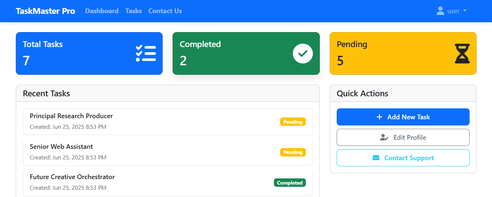

# ✅ TaskMaster Pro - A Task Management Application to Organize Your Daily Life

**TaskMaster Pro** is a secure, responsive, and fully-featured to-do list web application designed to help users efficiently manage their daily tasks. With separate dashboards for users and admin, it offers features like profile management, contact form, activity logs, role-based access, and more — all built using modern PHP and MySQL with best security practices.

---

## 🌐 Live Demo

🔗 [Visit TaskMaster Pro Live](https://taskmaster-pro.dreamcorpo.com/)  

---

## 🔐 Demo Login Information

### 👤 Normal User
- **Username**: user  
- **Password**: 000  

### 🛡️ Admin User
- **Username**: admin 
- **Password**: 123  

---

## 🛠️ Technologies Used

- **Frontend**: HTML, CSS, Bootstrap, JavaScript  
- **Backend**: PHP, MySQL  
- **Security**: Password Hashing, CSRF Tokens, Session Management

---

## 👤 User Features

- 🔐 **Authentication**: Sign Up, Login, Logout  
- 🔒 **Protected Access**: Dashboard accessible only after login (Session-based)  
- 📝 **Profile Management**: Update name, email, and password  
- 📩 **Contact Form**: Store user messages in the database  
- ✅ **To-Do List Manager**:
  - Add / Edit / Delete / Mark tasks as done
  - Filter and search tasks
  - Tasks load dynamically from the database

---

## 🛡️ Admin Features

> 🔧 Admin accounts must be manually created in the database by the owner.

- 🔐 **Admin Login with Role-Based Access Control**
- 👥 **User Management**:
  - View all registered users
  - Delete any user
  - Search and filter user list
- ✉️ **Message Management**:
  - View all contact form messages
  - Show read/unread status
  - Filter and search messages
- 🔧 **Admin Profile Update** (including password)

---

## 🔍 Extra Features

- 🔁 **Forgot Password System**:
  - Reset password via a security question
- 🧾 **Activity Logs (Admin Panel)**:
  - Record every add, delete, or edit action on tasks
- 🛡️ **Security Best Practices**:
  - `password_hash()` / `password_verify()` for secure password storage
  - PDO prepared statements to prevent SQL injection
  - CSRF tokens to prevent cross-site request forgery
  - `session_regenerate_id()` to avoid session hijacking
- 🔒 **Role-Based Access Control**:
  - Admin-only pages are protected by both session and role verification

---
🙌 Feedback & Contribution
If you find this project helpful, want to contribute, or have suggestions:

📧 Reach out: [Website](https://dev-mdjihadalom.pantheonsite.io/)
✨ Your feedback is always welcome!

📜 License
This project is free to use and does not require a license.
